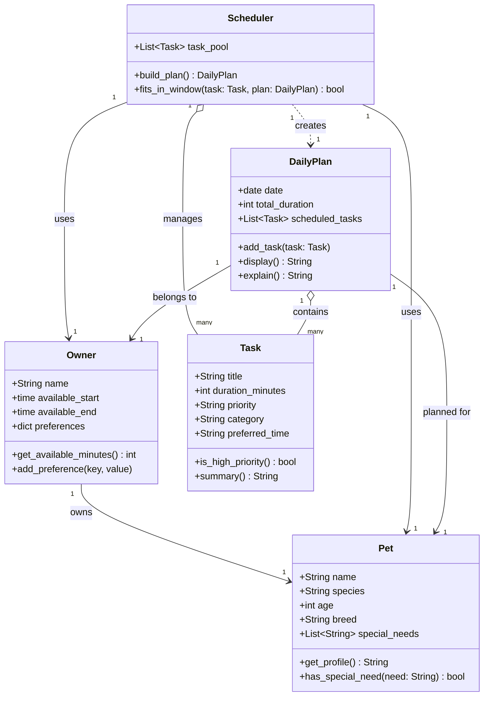

# PawPal+ Project Reflection

## 1. System Design

### Core User Actions

PawPal+ is built around three primary things a user needs to do:

1. **Add a pet** — The user registers their pet by providing its name, species, age, and any special needs (e.g., medication schedule, dietary restrictions). This establishes the subject of all care planning.

2. **Schedule a walk (or any care task)** — The user creates a care task by naming it, setting how long it takes, choosing a priority level, and optionally specifying a preferred time of day. Tasks are queued up to feed into the daily plan.

3. **See today's tasks** — The user triggers the scheduler, which looks at all pending tasks, the owner's available time window, and task priorities to produce an ordered daily plan. The plan shows what to do, when, and why each task was included.

---

### Object Model

**Pet**
- *Attributes:* `name` (str), `species` (str), `age` (int), `breed` (str), `special_needs` (list of str)
- *Methods:* `get_profile()` — returns a summary string of the pet's details; `has_special_need(need: str) -> bool` — checks whether a specific need is listed

**Owner**
- *Attributes:* `name` (str), `available_start` (time), `available_end` (time), `preferences` (dict)
- *Methods:* `get_available_minutes() -> int` — computes total minutes free in the day; `add_preference(key, value)` — stores a scheduling preference (e.g., no tasks after 9 pm)

**Task**
- *Attributes:* `title` (str), `duration_minutes` (int), `priority` (str: "low" | "medium" | "high"), `category` (str: e.g., "walk", "feeding", "medication"), `preferred_time` (str: "morning" | "afternoon" | "evening" | None)
- *Methods:* `is_high_priority() -> bool` — returns True if priority is "high"; `summary() -> str` — returns a one-line description of the task

**DailyPlan**
- *Attributes:* `date` (date), `owner` (Owner), `pet` (Pet), `scheduled_tasks` (list of Task), `total_duration` (int)
- *Methods:* `add_task(task: Task)` — appends a task and updates total duration; `display() -> str` — formats the plan as a readable list; `explain() -> str` — narrates why each task was included and in what order

**Scheduler**
- *Attributes:* `owner` (Owner), `pet` (Pet), `task_pool` (list of Task)
- *Methods:* `build_plan() -> DailyPlan` — selects and orders tasks that fit within the owner's time window, prioritizing high-priority items first; `fits_in_window(task: Task, plan: DailyPlan) -> bool` — checks if adding the task would exceed available time

### Class Diagram

---

**a. Initial design**

- Briefly describe your initial UML design.
- What classes did you include, and what responsibilities did you assign to each?

**b. Design changes**

- Did your design change during implementation?
- If yes, describe at least one change and why you made it.

---

## 2. Scheduling Logic and Tradeoffs

**a. Constraints and priorities**

- What constraints does your scheduler consider (for example: time, priority, preferences)?
- How did you decide which constraints mattered most?

**b. Tradeoffs**

- Describe one tradeoff your scheduler makes.
- Why is that tradeoff reasonable for this scenario?

---

## 3. AI Collaboration

**a. How you used AI**

- How did you use AI tools during this project (for example: design brainstorming, debugging, refactoring)?
- What kinds of prompts or questions were most helpful?

**b. Judgment and verification**

- Describe one moment where you did not accept an AI suggestion as-is.
- How did you evaluate or verify what the AI suggested?

---

## 4. Testing and Verification

**a. What you tested**

- What behaviors did you test?
- Why were these tests important?

**b. Confidence**

- How confident are you that your scheduler works correctly?
- What edge cases would you test next if you had more time?

---

## 5. Reflection

**a. What went well**

- What part of this project are you most satisfied with?

**b. What you would improve**

- If you had another iteration, what would you improve or redesign?

**c. Key takeaway**

- What is one important thing you learned about designing systems or working with AI on this project?
