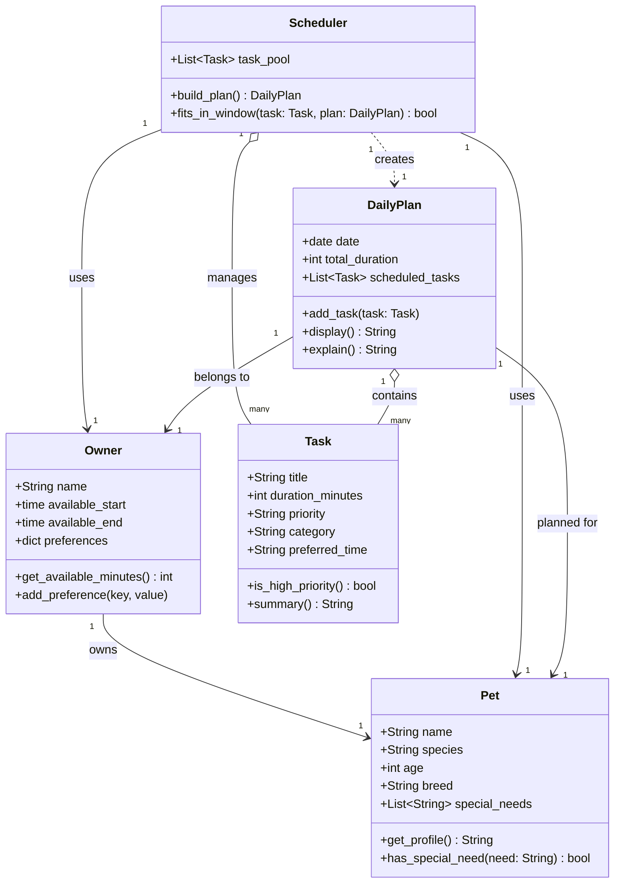

# PawPal+ Project Reflection

## 1. System Design

### Core User Actions

PawPal+ is built around three primary things a user needs to do:

1. **Add a pet** — The user registers their pet by providing its name, species, age, and any special needs (e.g., medication schedule, dietary restrictions). This establishes the subject of all care planning.

2. **Schedule a walk (or any care task)** — The user creates a care task by naming it, setting how long it takes, choosing a priority level, and optionally specifying a preferred time of day. Tasks are queued up to feed into the daily plan.

3. **See today's tasks** — The user triggers the scheduler, which looks at all pending tasks, the owner's available time window, and task priorities to produce an ordered daily plan. The plan shows what to do, when, and why each task was included.

---

### Object Model

**Pet**
- *Attributes:* `name` (str), `species` (str), `age` (int), `breed` (str), `special_needs` (list of str)
- *Methods:* `get_profile()` — returns a summary string of the pet's details; `has_special_need(need: str) -> bool` — checks whether a specific need is listed

**Owner**
- *Attributes:* `name` (str), `available_start` (time), `available_end` (time), `preferences` (dict)
- *Methods:* `get_available_minutes() -> int` — computes total minutes free in the day; `add_preference(key, value)` — stores a scheduling preference (e.g., no tasks after 9 pm)

**Task**
- *Attributes:* `title` (str), `duration_minutes` (int), `priority` (str: "low" | "medium" | "high"), `category` (str: e.g., "walk", "feeding", "medication"), `preferred_time` (str: "morning" | "afternoon" | "evening" | None)
- *Methods:* `is_high_priority() -> bool` — returns True if priority is "high"; `summary() -> str` — returns a one-line description of the task

**DailyPlan**
- *Attributes:* `date` (date), `owner` (Owner), `pet` (Pet), `scheduled_tasks` (list of Task), `total_duration` (int)
- *Methods:* `add_task(task: Task)` — appends a task and updates total duration; `display() -> str` — formats the plan as a readable list; `explain() -> str` — narrates why each task was included and in what order

**Scheduler**
- *Attributes:* `owner` (Owner), `pet` (Pet), `task_pool` (list of Task)
- *Methods:* `build_plan() -> DailyPlan` — selects and orders tasks that fit within the owner's time window, prioritizing high-priority items first; `fits_in_window(task: Task, plan: DailyPlan) -> bool` — checks if adding the task would exceed available time

### Class Diagram

---

**a. Initial design**

My initial design centered on five classes, each with a clear, single responsibility.

**Pet** is a data container for everything about the animal: its name, species, age, breed, and any special needs (e.g., medication, dietary restrictions). It can produce a readable profile string and answer yes/no questions about whether a particular need applies.

**Owner** captures who is doing the caregiving and when they are available. It holds a daily time window (`available_start` / `available_end`) and an open-ended preferences dictionary. Its key responsibility is computing how many minutes of free time exist in that window, which the scheduler uses as a hard budget.

**Task** represents one unit of work — a walk, a feeding, a medication dose. Each task knows its duration, its priority level (low / medium / high), its category, and an optional preferred time of day. It can identify itself as high-priority and produce a one-line summary, keeping display logic close to the data it describes.

**DailyPlan** is the output artifact. It ties together a specific date, an owner, and a pet, and accumulates the tasks the scheduler selects. Adding a task updates the running total duration automatically, so the plan always knows how full it is. It can format itself as a readable list (`display`) and narrate the reasoning behind its contents (`explain`).

**Scheduler** is the only class with real decision-making logic. It holds a pool of candidate tasks alongside the owner and pet it is planning for. `build_plan` selects and orders tasks that fit within the owner's time budget, using priority as the primary sort key. `fits_in_window` is a focused helper that keeps the budget check isolated from the selection loop.

**b. Design changes**

Yes, the design changed in six ways after reviewing the initial model for missing relationships and logic bottlenecks.

**1. Added `Priority` and `PreferredTime` enums.**
The original design used plain strings for `priority` and `preferred_time`. A typo like `"hight"` or `"Morning"` would silently break priority sorting and time-slot logic with no error. Replacing them with `Enum` classes makes invalid values a runtime error at assignment time and makes the valid options self-documenting.

**2. Added `pets: List[Pet]` to `Owner`.**
The original model implied a strict 1-to-1 relationship between an owner and a pet, but an owner realistically cares for more than one animal. Adding a `pets` list to `Owner` makes that relationship explicit and opens the door to multi-pet scheduling without redesigning the class.

**3. Added `pet: Optional[Pet]` to `Task`.**
Tasks in a shared pool had no way to express which animal they applied to. A medication task for one pet could accidentally be scheduled for another. Making the pet reference optional on `Task` lets the scheduler filter tasks by pet while still allowing generic tasks that apply to any animal.

**4. Added `depends_on: Optional[str]` to `Task`.**
The original design had no way to express ordering constraints. Medication often must come before feeding. `depends_on` stores the title of the task that must run first, giving the scheduler the information it needs to enforce sequencing without introducing circular references between `Task` objects.

**5. Made `total_duration` a computed `@property` on `DailyPlan`.**
As a plain mutable `int` field, `total_duration` could silently drift out of sync if anything appended directly to `scheduled_tasks` without going through `add_task`. Converting it to a `@property` that sums `scheduled_tasks` on demand makes it impossible for the value to be wrong — there is no separate state to keep in sync.

**6. Added `task_pool` and `rejected_tasks` to `DailyPlan`.**
The original `DailyPlan` stored only the selected tasks, which made `explain()` nearly impossible to implement meaningfully: the plan had no record of what was considered or why something was left out. Storing the full `task_pool` and a `rejected_tasks` list gives `explain()` everything it needs to narrate the scheduler's decisions.

---

## 2. Scheduling Logic and Tradeoffs

**a. Constraints and priorities**

- What constraints does your scheduler consider (for example: time, priority, preferences)?
- How did you decide which constraints mattered most?

**b. Tradeoffs**

- Describe one tradeoff your scheduler makes.
- Why is that tradeoff reasonable for this scenario?

---

## 3. AI Collaboration

**a. How you used AI**

- How did you use AI tools during this project (for example: design brainstorming, debugging, refactoring)?
- What kinds of prompts or questions were most helpful?

**b. Judgment and verification**

- Describe one moment where you did not accept an AI suggestion as-is.
- How did you evaluate or verify what the AI suggested?

---

## 4. Testing and Verification

**a. What you tested**

- What behaviors did you test?
- Why were these tests important?

**b. Confidence**

- How confident are you that your scheduler works correctly?
- What edge cases would you test next if you had more time?

---

## 5. Reflection

**a. What went well**

- What part of this project are you most satisfied with?

**b. What you would improve**

- If you had another iteration, what would you improve or redesign?

**c. Key takeaway**

- What is one important thing you learned about designing systems or working with AI on this project?
