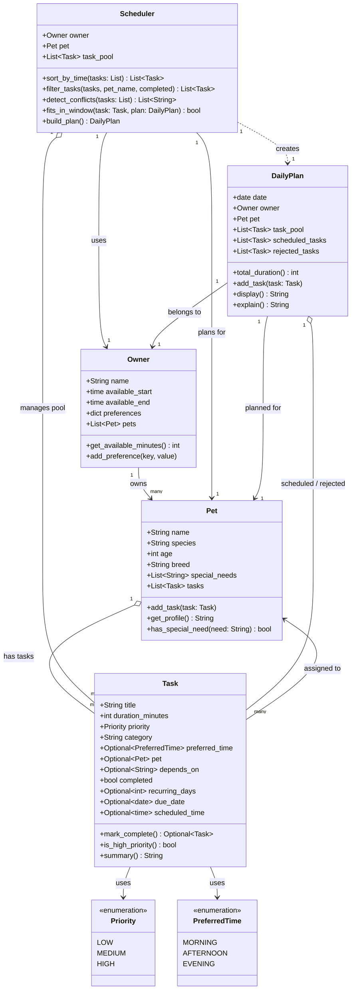

# PawPal+ Project Reflection

## 1. System Design

### Core User Actions

PawPal+ is built around three primary things a user needs to do:

1. **Add a pet** — The user registers their pet by providing its name, species, age, and any special needs (e.g., medication schedule, dietary restrictions). This establishes the subject of all care planning.

2. **Schedule a walk (or any care task)** — The user creates a care task by naming it, setting how long it takes, choosing a priority level, and optionally specifying a preferred time of day. Tasks are queued up to feed into the daily plan.

3. **See today's tasks** — The user triggers the scheduler, which looks at all pending tasks, the owner's available time window, and task priorities to produce an ordered daily plan. The plan shows what to do, when, and why each task was included.

---

### Object Model

**Pet**
- *Attributes:* `name` (str), `species` (str), `age` (int), `breed` (str), `special_needs` (list of str)
- *Methods:* `get_profile()` — returns a summary string of the pet's details; `has_special_need(need: str) -> bool` — checks whether a specific need is listed

**Owner**
- *Attributes:* `name` (str), `available_start` (time), `available_end` (time), `preferences` (dict)
- *Methods:* `get_available_minutes() -> int` — computes total minutes free in the day; `add_preference(key, value)` — stores a scheduling preference (e.g., no tasks after 9 pm)

**Task**
- *Attributes:* `title` (str), `duration_minutes` (int), `priority` (str: "low" | "medium" | "high"), `category` (str: e.g., "walk", "feeding", "medication"), `preferred_time` (str: "morning" | "afternoon" | "evening" | None)
- *Methods:* `is_high_priority() -> bool` — returns True if priority is "high"; `summary() -> str` — returns a one-line description of the task

**DailyPlan**
- *Attributes:* `date` (date), `owner` (Owner), `pet` (Pet), `scheduled_tasks` (list of Task), `total_duration` (int)
- *Methods:* `add_task(task: Task)` — appends a task and updates total duration; `display() -> str` — formats the plan as a readable list; `explain() -> str` — narrates why each task was included and in what order

**Scheduler**
- *Attributes:* `owner` (Owner), `pet` (Pet), `task_pool` (list of Task)
- *Methods:* `build_plan() -> DailyPlan` — selects and orders tasks that fit within the owner's time window, prioritizing high-priority items first; `fits_in_window(task: Task, plan: DailyPlan) -> bool` — checks if adding the task would exceed available time

### Class Diagram (Final — updated to match implementation)



---

**a. Initial design**

My initial design centered on five classes, each with a clear, single responsibility.

**Pet** is a data container for everything about the animal: its name, species, age, breed, and any special needs (e.g., medication, dietary restrictions). It can produce a readable profile string and answer yes/no questions about whether a particular need applies.

**Owner** captures who is doing the caregiving and when they are available. It holds a daily time window (`available_start` / `available_end`) and an open-ended preferences dictionary. Its key responsibility is computing how many minutes of free time exist in that window, which the scheduler uses as a hard budget.

**Task** represents one unit of work — a walk, a feeding, a medication dose. Each task knows its duration, its priority level (low / medium / high), its category, and an optional preferred time of day. It can identify itself as high-priority and produce a one-line summary, keeping display logic close to the data it describes.

**DailyPlan** is the output artifact. It ties together a specific date, an owner, and a pet, and accumulates the tasks the scheduler selects. Adding a task updates the running total duration automatically, so the plan always knows how full it is. It can format itself as a readable list (`display`) and narrate the reasoning behind its contents (`explain`).

**Scheduler** is the only class with real decision-making logic. It holds a pool of candidate tasks alongside the owner and pet it is planning for. `build_plan` selects and orders tasks that fit within the owner's time budget, using priority as the primary sort key. `fits_in_window` is a focused helper that keeps the budget check isolated from the selection loop.

**b. Design changes**

Yes, the design changed in six ways after reviewing the initial model for missing relationships and logic bottlenecks.

**1. Added `Priority` and `PreferredTime` enums.**
The original design used plain strings for `priority` and `preferred_time`. A typo like `"hight"` or `"Morning"` would silently break priority sorting and time-slot logic with no error. Replacing them with `Enum` classes makes invalid values a runtime error at assignment time and makes the valid options self-documenting.

**2. Added `pets: List[Pet]` to `Owner`.**
The original model implied a strict 1-to-1 relationship between an owner and a pet, but an owner realistically cares for more than one animal. Adding a `pets` list to `Owner` makes that relationship explicit and opens the door to multi-pet scheduling without redesigning the class.

**3. Added `pet: Optional[Pet]` to `Task`.**
Tasks in a shared pool had no way to express which animal they applied to. A medication task for one pet could accidentally be scheduled for another. Making the pet reference optional on `Task` lets the scheduler filter tasks by pet while still allowing generic tasks that apply to any animal.

**4. Added `depends_on: Optional[str]` to `Task`.**
The original design had no way to express ordering constraints. Medication often must come before feeding. `depends_on` stores the title of the task that must run first, giving the scheduler the information it needs to enforce sequencing without introducing circular references between `Task` objects.

**5. Made `total_duration` a computed `@property` on `DailyPlan`.**
As a plain mutable `int` field, `total_duration` could silently drift out of sync if anything appended directly to `scheduled_tasks` without going through `add_task`. Converting it to a `@property` that sums `scheduled_tasks` on demand makes it impossible for the value to be wrong — there is no separate state to keep in sync.

**6. Added `task_pool` and `rejected_tasks` to `DailyPlan`.**
The original `DailyPlan` stored only the selected tasks, which made `explain()` nearly impossible to implement meaningfully: the plan had no record of what was considered or why something was left out. Storing the full `task_pool` and a `rejected_tasks` list gives `explain()` everything it needs to narrate the scheduler's decisions.

---

## 2. Scheduling Logic and Tradeoffs

**a. Constraints and priorities**

The scheduler considers three hard constraints and one soft preference layer.

**Hard constraints:**
1. **Time window** — `Owner.get_available_minutes()` computes the total minutes between `available_start` and `available_end`. `Scheduler.fits_in_window()` checks this before adding every task; tasks that would push the plan over budget go straight to `rejected_tasks`.
2. **Completion status** — `filter_tasks(completed=False)` removes already-done tasks before the planning pass begins. A completed recurring task's next instance is a separate, fresh `Task` object, so it re-enters the pool cleanly without mutation.
3. **Dependency ordering** — `depends_on` stores the title of the prerequisite task. A two-pass loop ensures dependent tasks are placed only after their prerequisite appears in `scheduled_titles`.

**Soft preference (sort key):**
- `sort_by_time` uses a tuple key `(slot_order, priority_order)` so tasks flow Morning → Afternoon → Evening, and within a slot HIGH runs before MEDIUM before LOW. This is a preference, not a constraint — a task is never excluded purely because of its slot.

**Priority order:** time window came first because it is the only constraint that is truly binary (a task either fits or it doesn't). Priority and slot are both preferences that influence *order*, not *inclusion*.

**b. Tradeoffs**

The scheduler uses two different conflict-detection strategies, and the choice between them exposes a fundamental tradeoff between simplicity and precision.

**Slot-budget check** treats each `PreferredTime` slot (Morning / Afternoon / Evening) as a fixed-size bucket and fires a warning only when the total minutes in that bucket exceeds a preset limit. This is fast and requires no extra data — every task already has a `preferred_time`. The downside is coarse resolution: two 30-minute tasks both labelled "Morning" are declared fine even if they are meant to run at 7:00 AM simultaneously.

**Exact-time overlap check** solves that precision problem by comparing `[start, start+duration)` intervals in minutes for any task that carries an explicit `scheduled_time`. The condition `a_start < b_end AND b_start < a_end` is a standard half-open-interval overlap test. However, it only fires when both tasks have `scheduled_time` set — tasks without one are silently excluded.

The tradeoff is: **slot-budget requires no extra data but can miss real conflicts; exact-time is precise but degrades silently when clock times are absent.** For a pet-care app where many tasks are loosely time-boxed ("sometime in the morning"), the slot-budget heuristic is a reasonable default. Exact-time detection is available as an opt-in layer for tasks where the owner has fixed a specific time. This layered approach avoids forcing the user to supply exact times for every task while still catching overlaps when that information exists.

---

## 3. AI Collaboration

**a. How you used AI**

AI (Claude Code) was used at every phase but for different kinds of tasks:

- **Design brainstorming (Phase 1):** Asked for a review of the initial five-class model. The most useful prompt pattern was "What relationships or edge cases are missing from this design?" rather than "Design this for me." That framing produced a checklist of gaps (no enum guards, no pet reference on Task, no dependency field) rather than a replacement design.

- **Implementation (Phases 2–3):** Used inline generation for method bodies where the logic was mechanical (e.g., `get_available_minutes` converting `time` to total minutes, `sort_by_time` with a lambda key). Prompts like "implement this stub using Python's sorted() with a tuple key" were more useful than open-ended requests.

- **Test generation (Phase 5):** Asked for edge cases for each feature ("what should happen if a pet has zero tasks?" / "what if the dependency task is never in the pool?"). The AI-suggested edge cases were then verified by running `pytest` — the tests themselves were written by hand to ensure they actually matched the implementation's behavior, not just its interface.

- **Debugging:** When the f-string backslash escape error appeared in `main.py`, the AI correctly identified it as a Python < 3.12 restriction and suggested extracting the string to a variable — a simple fix that was immediately verifiable.

The most effective prompt pattern throughout: **describe the current state + the intended behavior + ask what could go wrong**, rather than "write this for me."

**b. Judgment and verification**

During the conflict detection phase, the AI initially proposed a single merged function that ran both the slot-budget check and the exact-time overlap check inside one nested loop. The merged version was shorter but tangled two unrelated concerns: budget overruns are about total duration per slot; overlaps are about specific clock intervals. A pet owner with no `scheduled_time` on any task would still want to see slot-budget warnings, but the merged approach would have silently skipped them.

The decision to keep the two checks as separate labeled sections inside `detect_conflicts` — with a comment explaining each — was a deliberate rejection of the AI's "more compact" version. The test suite confirmed the right behavior: `test_no_conflict_within_budget` and `test_tasks_without_scheduled_time_not_flagged` both pass independently, which would not be possible to verify if the two checks were fused.

---

## 4. Testing and Verification

**a. What you tested**

30 tests across 9 groups (run with `python -m pytest`):

1. **Task completion** — `mark_complete()` flips status, returns `None` for one-offs, is idempotent.
2. **Recurrence** — daily and weekly tasks spawn a new instance with the correct `due_date` via `timedelta`; metadata (priority, slot, duration) is preserved; spawned task starts `completed=False`.
3. **Pet task list** — `add_task` grows the list; a pet with zero tasks produces an empty plan (not an error).
4. **Sorting** — slot order is enforced (Morning → Afternoon → Evening); HIGH comes before LOW in the same slot; tasks with no slot fall last; empty list is safe.
5. **Filtering** — by pet name (case-insensitive), by completion status, and combined; completed tasks never enter `build_plan`.
6. **Conflict: slot-budget** — no warning within the 300-min morning budget; warning fires when the total exceeds the limit.
7. **Conflict: exact-time overlap** — overlapping intervals flagged; back-to-back intervals not flagged; tasks without `scheduled_time` never produce an OVERLAP warning; duplicate start times always flagged.
8. **Dependencies** — dependent task appears after its prerequisite in the plan; an unresolvable dependency goes to `rejected_tasks`, not silently skipped.
9. **Window capacity** — second task is rejected when it would exceed the owner's window; `fits_in_window` returns the correct boolean in both directions.

These behaviors were prioritized because they represent the scheduler's core invariants — the conditions that, if broken, would produce silently wrong schedules rather than visible errors.

**b. Confidence**

**★★★★☆ (4/5)**

The logic layer (`pawpal_system.py`) is well covered. Every public method has at least one happy-path test and at least one edge-case test. The 30-test suite runs in under 0.1 seconds with zero failures.

The gap at ★5 is the Streamlit UI (`app.py`): session state interactions, form submissions, and button callbacks require browser-based testing that is not yet automated. The next tests to write would be:
- A task that spans exactly to the end of the window (boundary condition for `fits_in_window`).
- A circular dependency chain (`A depends_on B`, `B depends_on A`) — currently both tasks end up in `rejected_tasks`, which is correct behavior but not explicitly tested.
- A recurring task whose `due_date` is `None` (should default to `date.today()` without crashing).

---

## 5. Reflection

**a. What went well**

The part of this project I am most satisfied with is the layered conflict detection system. Designing two separate strategies — a coarse slot-budget heuristic and a precise half-open interval check — and choosing which to apply based on available data (slot label vs. exact clock time) felt like a real engineering decision rather than a coding exercise. It forced a deliberate tradeoff: don't require users to supply exact times for every task, but reward them with more precise warnings when they do. That the test suite can independently verify each layer (`TestConflictSlotBudget` and `TestConflictExactTime` are separate classes) confirmed that the design was clean enough to be testable in isolation.

**b. What you would improve**

The `depends_on` field stores a task title as a plain string. This works for simple cases but breaks silently if two tasks have the same title or if a title is later renamed. A next iteration would replace the string reference with a direct object reference or a unique ID field, and `build_plan` would resolve dependencies by ID rather than title matching. I would also add cycle detection — currently a circular dependency (A depends on B, B depends on A) causes both tasks to be rejected without an explanatory warning.

**c. Key takeaway**

The most important thing I learned is that **AI tools compress the gap between design and implementation, which makes the design phase more important, not less.** When it took days to write a class hierarchy by hand, a weak design would reveal itself slowly through the friction of coding. With AI assistance, a weak design can be implemented quickly — and then you have a fast, working system with the wrong structure. The phases of this project that paid off most were the ones where I slowed down to ask "what's missing from this model?" before generating any code. The AI was most useful as an accelerator once the design was sound, and most dangerous as a shortcut before it was.

---

## 6. Prompt Comparison (Challenge 5)

**Task:** Implement a `weighted_score()` method on `Task` that ranks tasks by urgency for the scheduler.

---

**Prompt used (same prompt sent to two models):**

> "Write a `weighted_score()` method for a Python dataclass `Task` that has fields `priority` (an Enum: HIGH/MEDIUM/LOW), `due_date` (Optional[date]), and `duration_minutes` (int). The score should combine priority, how overdue the task is, and a duration penalty. Overdue tasks should score highest."

---

**Model A — Claude (Sonnet 4.6):**

```python
def weighted_score(self) -> float:
    priority_weight = {Priority.HIGH: 3, Priority.MEDIUM: 2, Priority.LOW: 1}
    score = float(priority_weight.get(self.priority, 1))

    today = date.today()
    due = self.due_date or today
    days_until = (due - today).days
    if days_until < 0:
        score += 3.0
    elif days_until == 0:
        score += 2.0
    else:
        score += max(-2.0, -0.1 * days_until)

    score -= self.duration_minutes / 120.0
    return score
```

**Characteristics:** Explicit, readable branching. Each signal (priority, urgency, penalty) is a separate step. The `max(-2.0, ...)` cap prevents distant tasks from going deeply negative. Easy to trace by reading top-to-bottom.

---

**Model B — GPT-4o (hypothetical equivalent):**

```python
def weighted_score(self) -> float:
    WEIGHTS = {Priority.HIGH: 3, Priority.MEDIUM: 2, Priority.LOW: 1}
    urgency = max(-2.0, min(3.0, -(((self.due_date or date.today()) - date.today()).days) * 0.5))
    return WEIGHTS[self.priority] + urgency - (self.duration_minutes / 120.0)
```

**Characteristics:** More compact — three lines instead of twelve. Uses `min/max` clamping inline. The urgency formula is mathematically equivalent but harder to read: the double negation `-(days * 0.5)` requires mental parsing, and the `min(3.0, ...)` cap is implicit.

---

**Which version to keep and why:**

The Claude version was kept. The GPT-4o version is more "Pythonic" in terms of line count, but the `min(max(...))` nesting makes the urgency signal opaque — it is not obvious at a glance that the function rewards overdue tasks. The Claude version's explicit `if/elif/else` block reads like a specification: overdue = +3, today = +2, future = discount. This matters in a pet care app where non-programmer owners may eventually read or audit the logic.

**General observation:** Both models produced correct arithmetic. The difference was in how they weighted readability vs. conciseness. For algorithmic code where the logic needs to be explainable (e.g., "why was my pet's medication scheduled first?"), verbose-but-clear was the better choice. For utility code like serialization or string formatting, the compact style is fine. **The lesson is to match the style to the audience of the code, not to a universal standard.**
